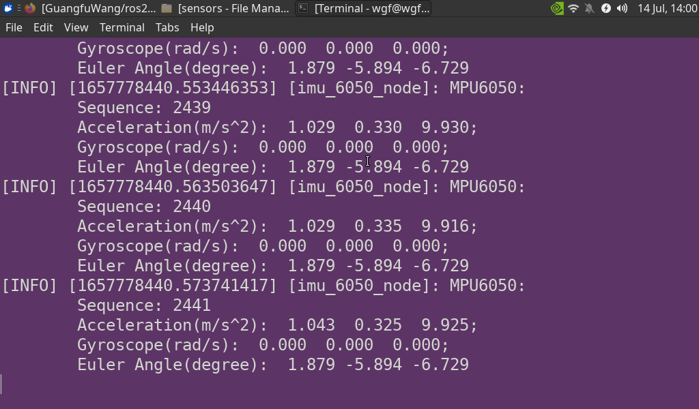

# ros2_imu_mpu6050
This is ros2 node for mpu 6050 imu.
## Build
1. first you need to create a workspace folder(in case you already have one, ignore this step):
```shell
sudo mkdir sensors 
cd sensors
sudo mkdir src
cd src
```
2. after create your workspace, download our source file using:
```shell
git clone https://github.com/GuangfuWang/ros2_imu_mpu6050.git
```
3. To build you need install ros properly and change the CMakeLists.txt file at line 33 to your ros2 distro(i use foxy so if you use this version, then nothing modification is required literally.)
back to your workspace directory, run:
```shell
cd .. //back to folder of /path/to/sensors
rosdep install --from-path src -y
```
to install all nessesary dependencies. (the above **src** can be changed to folders that contains our imu source files.)

run:
```shell
colcon build --packages-select imu
```
to build our executable

run:
```shell
. install/setup.bash
ros2 run imu mpu6050uart
```
to run our node.

## screenshots



## change config

to change configurations you can modify our settings,which locates at the top of our source files(MACROS).

## Topic 

our topic name is **"mpu6050"**.

## Communication protocol

we use UART as interface. if you use i2c, then you can wait for a while cause we will cover that later.

## Note

1. we woule like to keep this imu node simple, so we didnot use parameters or other staff that makes it complicated.
2. this ros2 node typically used in jetson plugged with uart, if you are not using jetson or plugged with i2c, you might encounter errors.
3. for non-jetson users, please change the **IMU_DEVICE_LOCATIION** macro in source file to which your mpu6050 device locates.
4. to change topic name, modify **MPU_6050_TOPIC** macro.
